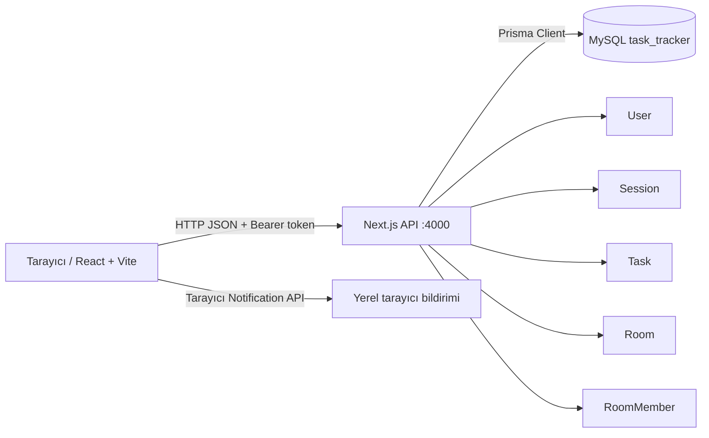

# Task Tracker

Task Tracker, kullanıcıların kendi görevlerini oluşturduğu, takip ettiği ve tamamladığı tam yığın bir görev yönetim uygulamasıdır. Uygulama, her kullanıcı için ayrı görev alanı oluşturur; bir kullanıcı başka kullanıcının görevlerini görüntüleyemez, güncelleyemez veya silemez.

Proje iki bağımsız uygulamadan oluşur:

- `backend/`: Next.js API, kullanıcı oturumları ve MySQL/Prisma veri katmanı
- `frontend/`: React, Vite ve Tailwind CSS ile hazırlanmış kullanıcı arayüzü

## İçindekiler

- [Amaç ve özellikler](#amaç-ve-özellikler)
- [Mimari](#mimari)
- [Klasör ve dosya rehberi](#klasör-ve-dosya-rehberi)
- [Kullanılan teknolojiler](#kullanılan-teknolojiler)
- [Veri modeli](#veri-modeli)
- [Kimlik doğrulama ve görev sahipliği](#kimlik-doğrulama-ve-görev-sahipliği)
- [Hatırlatıcı davranışı](#hatırlatıcı-davranışı)
- [Kurulum ve çalıştırma](#kurulum-ve-çalıştırma)
- [Demo verisi ve test hesapları](#demo-verisi-ve-test-hesapları)
- [API sözleşmesi](#api-sözleşmesi)
- [Güvenlik durumu](#güvenlik-durumu)
- [Sınırlamalar ve production önerileri](#sınırlamalar-ve-production-önerileri)

## Amaç ve özellikler

Uygulama, kişisel veya küçük ekip ölçeğinde görev takibi için temel bir çalışma alanı sunar.

- Kayıt olma ve giriş yapma
- Her kullanıcı için ayrı görev listesi
- Görev ekleme, durum değiştirme ve silme
- `Bekliyor`, `Devam Ediyor` ve `Tamamlandı` durumları
- Önemli görev işareti
- Seçilebilir tarih-saat hatırlatıcısı
- Uygulama açıkken tarayıcı bildirimi
- Kodla katılınabilen ekip odaları
- Kalıcı oda üyeliği ve kullanıcının isteğiyle odadan ayrılması
- Kişisel alan ile ekip odaları arasında geçiş yapan sol panel
- Tamamlanma oranı, toplam görev, önemli görev ve akış özeti içeren dashboard

## Mimari



Frontend 5173 portunda çalışır. Backend 4000 portunda REST API sunar. Frontend, giriş sonrasında aldığı oturum belirtecini `Authorization: Bearer <token>` başlığıyla API'ye gönderir. Backend, belirteçten kullanıcıyı bulur; kişisel görevleri `userId`, ekip görevlerini ise oda üyeliğiyle sınırlar.

Bu sınır uygulamanın gerçek hayattaki temel davranışıdır: aynı URL'yi açan iki kişi aynı kişisel görevleri görmez. Aynı uygulama ve aynı veritabanı kullanılır; kişisel sorgular oturumdaki kullanıcıya, oda sorguları ise yalnızca kullanıcının üye olduğu odaya filtrelenir.

## Klasör ve dosya rehberi

### Kök dizin

| Yol | Görevi |
| --- | --- |
| `README.md` | Projenin amacı, mimarisi, kurulumu, API'leri ve güvenlik notları. |
| `backend/` | Sunucu, API, Prisma şeması ve MySQL migration'ları. |
| `frontend/` | Tarayıcı arayüzü, bileşenler, API istemcisi ve stil ayarları. |

### `backend/`

| Yol | Görevi |
| --- | --- |
| `package.json` | Backend paketleri ile `dev`, `build` ve `start` komutlarını tanımlar. |
| `package-lock.json` | Kurulan paketlerin kesin sürümlerini kilitler; tekrar kurulabilir ortam sağlar. |
| `.env` | `DATABASE_URL` gibi yerel gizli yapılandırmayı tutar. Git'e eklenmez. |
| `.gitignore` | `.env`, `node_modules` ve `.next` gibi izlenmemesi gereken dosyaları hariç tutar. |
| `next.config.ts` | API için geliştirme ortamı CORS başlıklarını tanımlar. Frontend'in 5173 portundan istek gönderebilmesini sağlar. |
| `tsconfig.json` | Next.js ve TypeScript derleyicisinin tip kurallarını, `@/` yol takma adını ve dosya kapsamını tanımlar. |
| `next-env.d.ts` | Next.js tarafından oluşturulan TypeScript ortam bildirimidir. Elle düzenlenmez. |

### `backend/prisma/`

| Yol | Görevi |
| --- | --- |
| `schema.prisma` | MySQL bağlantısını, Prisma Client üretimini ve `User`, `Session`, `Task` veri modellerini tanımlar. Veritabanının kaynak şemasıdır. |
| `migrations/20260922061603_init/migration.sql` | İlk `Task` tablosunu oluşturan migration. |
| `migrations/20260922070000_add_users_and_reminders/migration.sql` | Kullanıcı, oturum, görev sahipliği, önem ve hatırlatıcı alanlarını ekler. Eski görevleri kaybetmemek için onları erişilemeyen bir import hesabına taşır. |
| `migrations/20260922072538_add_team_rooms/migration.sql` | Oda, oda üyeliği ve ekip görevleri için gereken alanları ekler; mevcut kişisel görevleri korur. |
| `migrations/migration_lock.toml` | Prisma'nın kullanılan veritabanı sağlayıcısını ve migration düzenini izlemesine yardım eder. |
| `seed.mjs` | İki demo kullanıcıyı, kişisel örnek görevleri, ortak Staj Ekibi odasını ve ekip görevlerini idempotent biçimde ekler. Mevcut veriyi silmez veya üzerine yazmaz. |

### `backend/src/lib/`

| Yol | Görevi |
| --- | --- |
| `prisma.ts` | Tek bir `PrismaClient` örneği üretir ve geliştirme sırasında gereksiz bağlantı çoğalmasını önler. |
| `auth.ts` | `Authorization` başlığındaki Bearer token'ı çözer, geçerli oturum ve kullanıcıyı bulur; ayrıca güvenli rastgele oturum token'ı üretir. |
| `room.ts` | Oda üyeliğini doğrular ve rastgele oda giriş kodu üretir. |

### `backend/src/app/api/`

Next.js App Router'da her `route.ts` dosyası bir HTTP endpoint'idir.

| Yol | Görevi |
| --- | --- |
| `auth/register/route.ts` | Kullanıcı kaydı yapar, parolayı bcrypt ile hashler, oturum oluşturur ve token döner. |
| `auth/login/route.ts` | E-posta/parola doğrulaması yapar, yeni 7 günlük oturum oluşturur. |
| `auth/logout/route.ts` | Geçerli token'a karşılık gelen oturumu siler. |
| `tasks/route.ts` | Kişisel veya seçili oda görevlerini listeler; yeni görevi kişisel alana ya da üye olunan odaya ekler. |
| `tasks/[id]/route.ts` | Görev durumunu veya alanlarını günceller/siler. Kişisel görevde sahipliği, oda görevinde üyeliği doğrular. |
| `rooms/route.ts` | Kalıcı oda üyeliklerini listeler ve giriş kodu olan yeni oda oluşturur. |
| `rooms/join/route.ts` | Giriş kodu ile kullanıcıyı odaya ekler; mevcut üyeliği korur. |
| `rooms/[id]/leave/route.ts` | Kullanıcının kendi isteğiyle odadan ayrılmasını sağlar. |

### `frontend/`

| Yol | Görevi |
| --- | --- |
| `package.json` | Frontend bağımlılıklarını, geliştirme sunucusunu ve build komutunu tanımlar. |
| `package-lock.json` | Frontend bağımlılık sürümlerini kesin olarak kaydeder. |
| `.gitignore` | `node_modules` ve üretim çıktısı olan `dist` klasörünü Git dışında bırakır. |
| `index.html` | Vite'ın tarayıcıya sunduğu tek HTML kabuğudur; React kök elemanını ve Inter yazı tipini içerir. |
| `vite.config.ts` | React eklentisini etkinleştirir ve Vite geliştirme portunu 5173 olarak belirler. |
| `tailwind.config.js` | Tailwind'in dosya tarama alanını, Inter yazı tipini ve mevcut indigo `brand` renk paletini tanımlar. |
| `postcss.config.js` | Tailwind CSS ve Autoprefixer'ın CSS işleme zincirini tanımlar. |
| `tsconfig.json` | Frontend TypeScript/JSX kurallarını tanımlar. |
| `tsconfig.node.json` | Vite yapılandırma dosyasının Node ortamında tip denetimini sağlar. |

### `frontend/src/`

| Yol | Görevi |
| --- | --- |
| `main.tsx` | React uygulamasını `#root` elemanına bağlayan giriş noktasıdır. Global CSS'i yükler. |
| `App.tsx` | Oturum, kişisel alan/oda seçimi, görevler, dashboard özeti, bildirim zamanlayıcısı ve giriş/çıkış akışını yönetir. |
| `index.css` | Tailwind katmanlarını yükler; gövde stili ve yeniden kullanılan `.field` form alanı sınıfını tanımlar. |
| `types/task.ts` | Frontend'in beklediği `Task` ve `TaskStatus` TypeScript tiplerini tanımlar. |
| `api/taskApi.ts` | Frontend ile backend arasındaki tüm fetch çağrılarını ve token başlıklarını tek yerde toplar. |
| `components/AuthScreen.tsx` | Giriş ve kayıt ekranını; form doğrulamasını ve hata mesajlarını sunar. |
| `components/TaskForm.tsx` | Başlık, açıklama, önem seçeneği ve tarih-saat hatırlatıcısı içeren yeni görev formudur. |
| `components/TaskList.tsx` | Aynı durumdaki görevleri kolon olarak listeler ve boş durum arayüzünü gösterir. |
| `components/TaskCard.tsx` | Tek bir görevin başlığını, açıklamasını, önem/hatırlatıcı bilgisini, durum seçicisini ve silme düğmesini gösterir. |
| `components/RoomSidebar.tsx` | Kişisel alan ve odalar arasında geçişi; oda oluşturma, kodla katılma ve ayrılma eylemlerini sunar. |

### Çalışma zamanı ve üretilen klasörler

| Yol | Görevi |
| --- | --- |
| `backend/node_modules/` | Backend paketlerinin yerel kopyasıdır. `npm install` ile oluşur; Git'e eklenmez. |
| `frontend/node_modules/` | Frontend paketlerinin yerel kopyasıdır. `npm install` ile oluşur; Git'e eklenmez. |
| `backend/.next/` | Next.js build/geliştirme çıktısıdır. Otomatik üretilir; Git'e eklenmez. |
| `frontend/dist/` | `npm run build` sonrasında oluşan statik frontend çıktısıdır. Git'e eklenmez. |

## Kullanılan teknolojiler

| Teknoloji | Nerede kullanılır | Neden tercih edildi | Olmasa ne eksik kalır |
| --- | --- | --- | --- |
| Node.js 22 | Her iki uygulamanın çalışma zamanı | Modern JavaScript/TypeScript araç zinciri için gerekli, Next ve Vite ile uyumlu | `npm`, Next.js, Vite ve build komutları çalışmaz. |
| TypeScript | Backend ve frontend kaynak kodu | Veri tiplerini derleme aşamasında denetler, API ile arayüz arasındaki hataları azaltır | Yanlış alan adları, yanlış durum değerleri ve tip uyumsuzlukları daha geç fark edilir. |
| Next.js 15 | Backend | App Router üzerinden API route'ları sunar; dosya tabanlı endpoint yapısı sağlar | API için ayrı bir HTTP sunucusu ve routing katmanı yazmak gerekir. |
| React 18 | Frontend | Bileşen tabanlı ekran, state ve kullanıcı etkileşimleri için kullanılır | Dashboard, formlar ve görev listeleri elle DOM yönetimi gerektirir. |
| Vite 5 | Frontend geliştirme/build aracı | Hızlı geliştirme sunucusu ve optimize statik üretim çıktısı sağlar | React dosyalarını dönüştürmek, canlı geliştirme ortamı ve production paketi oluşturmak zorlaşır. |
| Tailwind CSS 3 | Frontend stilleri | Bileşene yakın, tutarlı ve hızlı utility sınıflarıyla minimal tasarım sağlar | Aynı görünüm için geniş özel CSS yazmak gerekir. |
| PostCSS + Autoprefixer | CSS build zinciri | Tailwind'i işler ve CSS uyumluluğunu iyileştirir | Tailwind direktifleri tarayıcı CSS'ine dönüşmez; prefix uyumluluğu azalır. |
| MySQL 8.4 | Kalıcı veri tabanı | Kullanıcılar, oturumlar ve görevler arasında ilişkisel ve kalıcı veri depolar | Uygulama yeniden başlatıldığında görevler ve kullanıcılar kaybolur. |
| Prisma 5 | Backend veri erişimi | Şemayı kod olarak tanımlar, migration üretir ve tipli MySQL sorguları sağlar | SQL sorguları ve şema değişiklikleri elle yönetilir; hata riski artar. |
| `@prisma/client` | Backend çalışma zamanı | Prisma şemasındaki modeller için tipli istemci sunar | `User`, `Session`, `Task` sorguları çalışmaz. |
| bcryptjs | Backend kayıt/giriş akışı | Parolayı düz metin yerine maliyet faktörlü hash olarak saklar | Veritabanı sızıntısında kullanıcı parolaları doğrudan açığa çıkar. |
| Tarayıcı Notification API | Frontend hatırlatıcısı | İzin verildiğinde uygulama açıkken yerel bildirim gösterir | Hatırlatıcı yalnızca dashboard içindeki bilgi olarak kalır. |

`@types/node`, `@types/react`, `@types/react-dom` ve `@types/bcryptjs` paketleri çalışma zamanı paketi değildir. TypeScript derleyicisinin ilgili kütüphaneleri doğru tanıması için geliştirme bağımlılığı olarak kullanılır.

## Veri modeli

### User

| Alan | Açıklama |
| --- | --- |
| `id` | Otomatik artan birincil anahtar. |
| `name` | Kullanıcının görünen adı. |
| `email` | Benzersiz giriş e-postası. |
| `passwordHash` | bcrypt ile hashlenmiş parola. Düz metin parola tutulmaz. |
| `phone` | İleride SMS entegrasyonu için ayrılmış isteğe bağlı alan. Arayüz şu an bu alanı toplamaz. |
| `createdAt` | Kayıt zamanı. |

### Session

| Alan | Açıklama |
| --- | --- |
| `token` | Kriptografik rastgele UUID parçalarından oluşan benzersiz oturum belirteci. |
| `userId` | Oturumun ait olduğu kullanıcı. |
| `expiresAt` | Token'ın geçerliliğinin bittiği tarih; şu anda 7 gün sonrasıdır. |
| `createdAt` | Oturumun oluşturulma zamanı. |

### Task

| Alan | Açıklama |
| --- | --- |
| `id` | Otomatik artan görev kimliği. |
| `title` | Zorunlu görev başlığı, en fazla 255 karakter. |
| `description` | İsteğe bağlı görev açıklaması. |
| `status` | `pending`, `in_progress` veya `done`. |
| `isImportant` | Görevin önemli olup olmadığını belirtir. |
| `reminderAt` | İsteğe bağlı ISO tarih-saat hatırlatıcısı. |
| `userId` | Kişisel görevse sahibi olan kullanıcı; oda görevi ise `null`. |
| `roomId` | Ekip görevinin ait olduğu oda; kişisel görevde `null`. |
| `createdAt`, `updatedAt` | Oluşturulma ve son güncellenme zamanları. |

Bir görev kişisel alan veya ekip odasına ait olur. Kullanıcı silinirse kişisel görevleri ve oturumları, oda silinirse o odanın görevleri `onDelete: Cascade` davranışıyla silinir.

### Room

| Alan | Açıklama |
| --- | --- |
| `id` | Otomatik artan oda kimliği. |
| `name` | Sol panelde görünen oda adı. |
| `joinCode` | Odaya ilk kez katılmak için kullanılan, benzersiz ve rastgele üretilen kod. |
| `ownerId` | Odayı oluşturan veya sahipliği devralan kullanıcı. |
| `createdAt`, `updatedAt` | Odanın oluşturulma ve son güncellenme zamanları. |

### RoomMember

| Alan | Açıklama |
| --- | --- |
| `roomId` | Üye olunan oda. |
| `userId` | Odaya katılan kullanıcı. |
| `role` | `owner` veya `member`; şu an sahiplik devri bilgisini tutar. |
| `createdAt` | Kullanıcının odaya ilk katıldığı zaman. |

`@@unique([roomId, userId])` kuralı, bir kullanıcının aynı odaya birden fazla üyelik kaydıyla katılmasını engeller. Üyelik veritabanında kalıcıdır; kullanıcı oturum kapattığında veya tekrar giriş yaptığında oda listesi kaybolmaz.

## Kimlik doğrulama ve görev sahipliği

1. Kullanıcı kayıt olduğunda backend e-postayı normalize eder, parolayı bcrypt ile hashler ve kullanıcıyı kaydeder.
2. Kayıt veya giriş başarılı olduğunda backend yeni bir `Session` kaydı ve token üretir.
3. Frontend token ile kullanıcı bilgisini `localStorage` içinde saklar.
4. Her korunan istek `Authorization: Bearer <token>` başlığını taşır.
5. `currentUser` token'ı veritabanındaki oturumla eşleştirir ve süresini kontrol eder.
6. Kişisel görev listeleme sorgusu `where: { userId: user.id, roomId: null }` ile filtrelenir.
7. Oda listesi, kullanıcının `RoomMember` kayıtlarından alınır. Kullanıcı oda kodunu yalnızca ilk katılımda kullanır; sonraki girişlerinde oda üyeliği korunur.
8. Oda görevleri istenmeden önce kullanıcının o odada üyeliği doğrulanır.
9. Güncelleme ve silme işlemi kişisel görevde sahipliği, oda görevinde üyeliği doğrular. Eşleşme yoksa `404` döner.

Bu nedenle Mehmet'in token'ı ile Ayşe'nin kişisel görev kimliği kullanılsa bile görev değiştirilemez veya silinemez. İki kullanıcı aynı odaya üyeyse, o odadaki ortak görevleri birlikte görür ve yönetir.

### Oda yaşam döngüsü

1. Kullanıcı sol panelden oda adı girerek oda oluşturur.
2. Backend benzersiz, 12 karakterlik rastgele giriş kodu oluşturur ve kurucuyu otomatik olarak `owner` üyesi yapar.
3. Başka bir kullanıcı yalnızca bu kodu girerek ilk kez odaya katılır.
4. Katılım sonrasında oda `RoomMember` kaydı sayesinde sol panelde kalıcı görünür; tekrar kod girmek gerekmez.
5. Kullanıcı `Ayrıl` eylemiyle kendi isteğiyle üyeliğini siler.
6. Sahip ayrılırken başka üye varsa en eski kalan üye otomatik olarak yeni `owner` olur. Sahip tek üyeyse oda silinir.

## Hatırlatıcı davranışı

Hatırlatıcı bir göreve eklenebilen isteğe bağlı tarih-saat bilgisidir. Mevcut uygulama davranışı şöyledir:

- Görev `pending` durumundaysa ve zamanı geldiyse tarayıcı bildirimi oluşturur.
- Görev `in_progress` durumundaysa bildirim göndermez.
- Görev `done` durumundaysa bildirim göndermez.
- Kontrol, uygulama açıkken 30 saniyede bir yapılır.
- Aynı tarayıcı sekmesi/oturumu içinde bir görev için tekrar bildirim gönderilmez.
- Tarayıcı izin istemini reddederse bildirim görünmez.

Bu mekanizma telefon SMS'i veya arka planda çalışan push bildirimi değildir. Telefon numarasına gerçek SMS göndermek için Twilio, Vonage veya AWS SNS gibi bir sağlayıcı; hesap, ücretlendirme, telefon doğrulaması ve sunucuda saklanacak gizli anahtarlar gerekir. Mobil push için ise HTTPS, PWA/service worker, VAPID anahtarları ve sunucudan push gönderim altyapısı gerekir.

## Kurulum ve çalıştırma

### Gereksinimler

- Node.js 22.x
- npm 10.x veya Node 22 ile gelen uyumlu npm
- MySQL Server 8.4.x
- Çalışan MySQL servisi
- `root@localhost` kullanıcısının yerel erişimi
- `task_tracker` isimli MySQL veritabanı

Bu projede MySQL bağlantısı aşağıdaki biçimdedir:

```env
DATABASE_URL="mysql://root@localhost:3306/task_tracker"
```

MySQL 8.4 istemcisi bu ortamda aşağıdaki yoldadır:

```bash
/opt/homebrew/opt/mysql@8.4/bin/mysql
```

### 1. Veritabanını oluşturma

Veritabanı yoksa MySQL istemcisinde aşağıdaki komutu çalıştırın:

```sql
CREATE DATABASE task_tracker
  CHARACTER SET utf8mb4
  COLLATE utf8mb4_unicode_ci;
```

### 2. Backend kurulumu

```bash
cd /Users/sura/Documents/ChatGPT/task-tracker/backend
PATH=/opt/homebrew/opt/node@22/bin:$PATH npm install
PATH=/opt/homebrew/opt/node@22/bin:$PATH npx prisma migrate deploy
PATH=/opt/homebrew/opt/node@22/bin:$PATH npx prisma generate
```

Yerel geliştirme sunucusunu başlatın:

```bash
PATH=/opt/homebrew/opt/node@22/bin:$PATH npm run dev
```

Backend adresi: `http://localhost:4000`

Geliştirme yerine production build testi için:

```bash
PATH=/opt/homebrew/opt/node@22/bin:$PATH npm run build
PATH=/opt/homebrew/opt/node@22/bin:$PATH npm run start
```

### 3. Frontend kurulumu

Yeni bir terminal açın:

```bash
cd /Users/sura/Documents/ChatGPT/task-tracker/frontend
PATH=/opt/homebrew/opt/node@22/bin:$PATH npm install
PATH=/opt/homebrew/opt/node@22/bin:$PATH npm run dev
```

Frontend adresi: `http://localhost:5173`

Production build testi:

```bash
PATH=/opt/homebrew/opt/node@22/bin:$PATH npm run build
```

### Node yolu notu

Bu bilgisayarda genel PATH üzerindeki Node 25 bağlantısı eksik bir sistem kütüphanesi nedeniyle çalışmıyor. Node 22 kurulumu sağlıklı olduğundan komutlarda aşağıdaki önek kullanılır:

```bash
PATH=/opt/homebrew/opt/node@22/bin:$PATH
```

Bu önek yalnızca ilgili komutta Node 22'yi öne alır; bilgisayardaki global Node kurulumunu değiştirmez.

### Port çakışması

4000 veya 5173 portu kullanımda ise mevcut süreci kontrol edin:

```bash
lsof -nP -iTCP:4000 -sTCP:LISTEN
lsof -nP -iTCP:5173 -sTCP:LISTEN
```

Eski bir geliştirme sürecini kapatmak gerekiyorsa, süreç kimliğini doğruladıktan sonra kapatın ve sunucuyu yeniden başlatın. Next.js geliştirme sunucusu açıkken `.next` klasörünün başka bir build tarafından değiştirilmesi geçersiz bundle hatalarına neden olabilir.

## Demo verisi ve test hesapları

Demo verisini eklemek veya eksikse tekrar oluşturmak için:

```bash
cd /Users/sura/Documents/ChatGPT/task-tracker/backend
PATH=/opt/homebrew/opt/node@22/bin:$PATH node prisma/seed.mjs
```


Seed ayrıca aşağıdaki ortak çalışma alanını oluşturur:

| Oda | Sahip | Kalıcı üyeler | Giriş kodu | Ortak görev |
| --- | --- | --- | --- | --- |
| Staj Ekibi | Ayşe Yılmaz | Ayşe Yılmaz, Mehmet Kaya | `STAJ-EKIP-01` | 2 |

Seed betiği her kullanıcı için zaten görev varsa yeni görev eklemez. Böylece betik tekrar çalıştırıldığında demo görevleri çoğalmaz ve kullanıcı tarafından eklenmiş görevler silinmez.


## API sözleşmesi

API kök adresi: `http://localhost:4000/api`

Korunan endpoint'ler aşağıdaki başlığı bekler:

```http
Authorization: Bearer <session-token>
```

### Kimlik doğrulama endpoint'leri

| Method | URL | Kimlik doğrulama | Açıklama |
| --- | --- | --- | --- |
| `POST` | `/auth/register` | Hayır | Yeni kullanıcı ve ilk oturum oluşturur. |
| `POST` | `/auth/login` | Hayır | Giriş yapar ve yeni oturum token'ı döner. |
| `POST` | `/auth/logout` | Evet | Gönderilen token'ın oturumunu sonlandırır. |

Kayıt gövdesi:

```json
{
  "name": "Ada Demir",
  "email": "ada@example.com",
  "password": "en-az-8-karakter"
}
```

Giriş gövdesi:

```json
{
  "email": "ada@example.com",
  "password": "en-az-8-karakter"
}
```

Başarılı giriş/kayıt yanıtı:

```json
{
  "token": "oturum-belirteci",
  "user": {
    "id": 1,
    "name": "Ada Demir",
    "email": "ada@example.com"
  }
}
```

### Görev endpoint'leri

| Method | URL | Açıklama |
| --- | --- | --- |
| `GET` | `/tasks` | Oturumdaki kullanıcının görevlerini listeler. |
| `POST` | `/tasks` | Oturumdaki kullanıcı için yeni görev oluşturur. |
| `PUT` | `/tasks/:id` | Kullanıcının kendi görevini günceller. |
| `DELETE` | `/tasks/:id` | Kullanıcının kendi görevini siler. |

`GET /tasks?roomId=<id>` çağrısı, yalnızca token sahibi o odanın üyesiyse oda görevlerini döner. `POST /tasks` gövdesine `roomId` eklenirse görev kişisel alan yerine o odaya eklenir.

Görev oluşturma örneği:

```json
{
  "title": "Sunum hazırla",
  "description": "Staj sunumu için slayt hazırla",
  "isImportant": true,
  "reminderAt": "2026-09-23T08:30:00.000Z"
}
```

Oda görevi oluşturma örneği:

```json
{
  "title": "Toplantı notlarını düzenle",
  "description": "Ekip kararlarını tek belgede topla.",
  "roomId": 1,
  "isImportant": false,
  "reminderAt": null
}
```

Görev güncelleme örnekleri:

```json
{ "status": "in_progress" }
```

```json
{
  "status": "pending",
  "isImportant": true,
  "reminderAt": "2026-09-23T08:30:00.000Z"
}
```

Geçerli durum değerleri yalnızca şunlardır:

```text
pending
in_progress
done
```

### Oda endpoint'leri

| Method | URL | Açıklama |
| --- | --- | --- |
| `GET` | `/rooms` | Giriş yapan kullanıcının kalıcı oda üyeliklerini listeler. |
| `POST` | `/rooms` | Yeni oda oluşturur; oluşturan kullanıcı otomatik üye/sahip olur. |
| `POST` | `/rooms/join` | Giriş koduyla odaya katılır. Mevcut üyelik tekrar oluşturulmaz. |
| `POST` | `/rooms/:id/leave` | Kullanıcının kendi isteğiyle odadan ayrılmasını sağlar. |

Oda oluşturma gövdesi:

```json
{ "name": "Tasarım Ekibi" }
```

Odaya katılma gövdesi:

```json
{ "code": "A1B2C3D4E5F6" }
```

## Güvenlik durumu

### Uygulanmış korumalar

- Parolalar düz metin olarak tutulmaz; bcrypt maliyet faktörü 12 ile hashlenir.
- E-posta alanı normalize edilir ve benzersizdir.
- Rastgele token'lı, süreli veritabanı oturumları kullanılır.
- API, token olmadan görev verisi döndürmez.
- Görev güncelleme ve silme işlemlerinde sahiplik kontrolü vardır.
- `id` parametresi pozitif tamsayı olarak doğrulanır.
- `status` alanı izin verilen üç değerle sınırlandırılır.
- `.env` dosyası Git dışında tutulur.

### Mevcut bağımlılık denetimi

`npm audit` sonucunda, mevcut sürümlerde aşağıdaki uyarılar bulunmaktadır:

| Alan | Seviye | Paket | Açıklama | Güvenli güncelleme yönü |
| --- | --- | --- | --- | --- |
| Backend | Yüksek | PostCSS, Next.js üzerinden | Saldırgan kontrollü source map yorumlarıyla dosya okuma/bilgi sızdırma uyarıları | Next.js'in güncel, güvenli major sürümüne planlı geçiş. |
| Backend | Orta | PostCSS, Next.js üzerinden | Escape edilmemiş CSS çıktısında XSS uyarısı | Next.js/PostCSS yükseltmesi. |
| Frontend | Yüksek | Vite 5 üzerinden | Optimize bağımlılık source map işleme/path traversal uyarıları | Vite'ın güncel major sürümüne planlı geçiş. |
| Frontend | Orta | esbuild, Vite üzerinden | Geliştirme sunucusuna yönelik istek/yanıt okuma uyarısı | Vite yükseltmesi ve geliştirme sunucusunu herkese açık çalıştırmama. |

Bu paket güncellemeleri major sürüm sıçraması gerektirebilir. Bu nedenle otomatik `npm audit fix --force` çalıştırmak yerine önce ayrı bir branch üzerinde güncelleme, build ve uçtan uca test yapılmalıdır.


## Sınırlamalar ve production önerileri

- Hatırlatıcı yalnızca uygulama açıkken tarayıcı tarafında kontrol edilir. Sekme kapalıysa ya da cihaz çevrimdışıysa çalışmaz.
- Telefon SMS bildirimi uygulanmış değildir. Telefon numarası alanı veri modelinde gelecekteki entegrasyon için vardır.
- Gerçek mobil push, service worker ve sunucu tarafında planlanmış bildirim gönderimi gerektirir.
- Oturum belirteci şu anda localStorage'dadır; production için cookie tabanlı oturuma geçilmelidir.
- API testleri, rate limit, erişim kontrolü ve bildirim zamanlaması için otomatik test paketi henüz eklenmemiştir.
- CORS ayarı yerel frontend adresi olan `http://localhost:5173` için yapılmıştır; yayın ortamında değiştirilmelidir.

## Yararlı komutlar

```bash
# Backend migration durumunu kontrol et
cd /Users/sura/Documents/ChatGPT/task-tracker/backend
PATH=/opt/homebrew/opt/node@22/bin:$PATH npx prisma migrate status

# Prisma Studio ile veritabanını görsel olarak incele
PATH=/opt/homebrew/opt/node@22/bin:$PATH npx prisma studio

# Backend production build
PATH=/opt/homebrew/opt/node@22/bin:$PATH npm run build

# Frontend production build
cd /Users/sura/Documents/ChatGPT/task-tracker/frontend
PATH=/opt/homebrew/opt/node@22/bin:$PATH npm run build

# Bağımlılık güvenlik raporu
PATH=/opt/homebrew/opt/node@22/bin:$PATH npm audit
```

## Lisans

Bu proje öğrenme amacıyla hazırlanmıştır. Yayınlama veya ticari kullanım öncesinde güvenlik, kullanıcı verisi, bildirim izinleri ve lisans gereksinimleri ayrıca değerlendirilmelidir.
